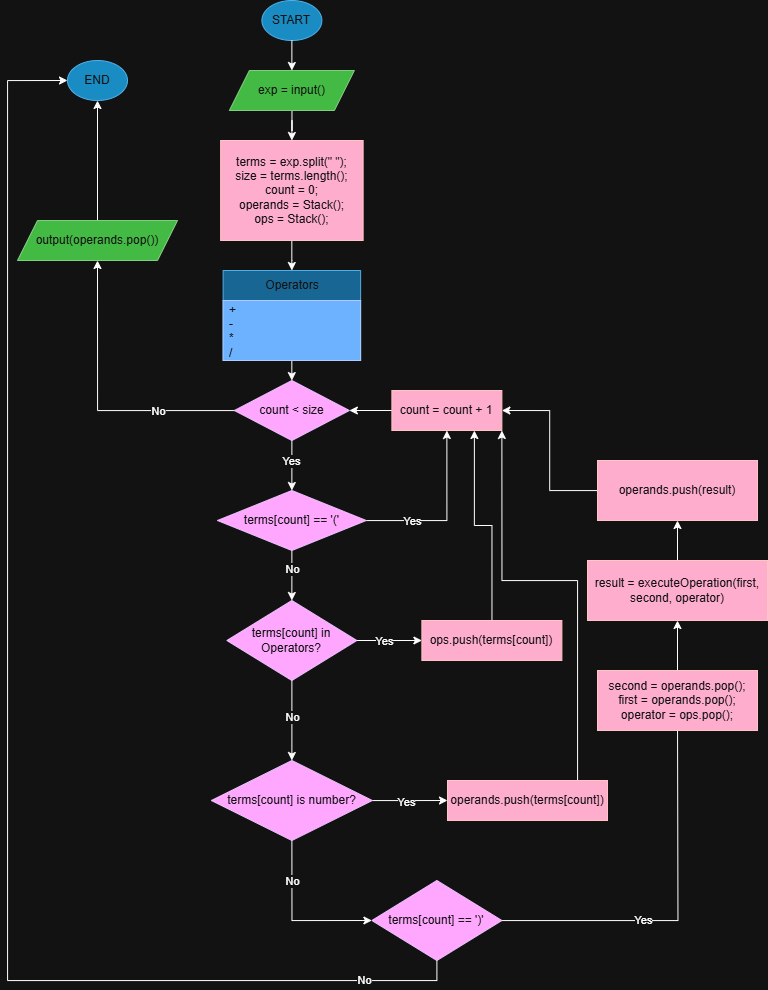

**DESIGN**
==========

The main data structure required for this algorithm is a stack which is a Last in First out (LIFO) structure. The algorithm requires two of these, one to store the operands (numbers) and the other to store the operators (+, -, /, *).

The flowchart for the main algorithm is - 

